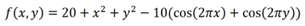
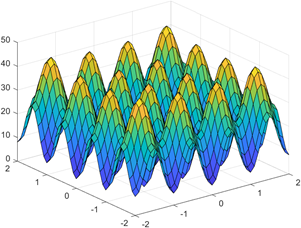
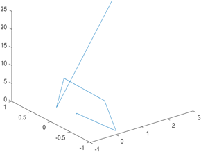
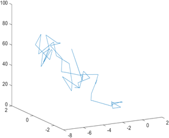

# Optimization using Particle Swarm and Simulated Annealing Algorithms!

**Particle Swarm Optimization (PSO)**

The fundamental idea behind PSO is to initialize many particles in order to search for the minimum. Each particle has an initial velocity and position. As the iterations continue, the velocity of each particle is pulled toward the known minimum of the group, so they gradually search closer to the global minimum.

More complex PSO algorithms will create subgroups in order to search around different local minimums for a global minimum. This has not been implemented in this code but could be a future improvement.

**Simulated Annealing**

Simulated Annealing seeks to solve the same problem as PSO. However, it does so in a very different manner. The engineers who first designed it took inspiration from annealing in metallurgy, where molecules would slowly be pushed towards a global minimum energy state. At high temperatures, the molecules are still able to explore new positions at higher energy levels, but at lower temperatures, the probability of being able to go up in energy between steps is exponentially decreased to finish in a global optimum.

Our algorithm works similarly. We start with an initial temperature of 100 (hot) which gives our function the ability to go up in energy states when exploring with high probability. Then with each iteration, we lower the temperature by a factor of alpha (a configurable hyperparameter) until the system settles at a low temperature

# Example function

A sample function has been included with this repository.

This function is a classical egg carton function with a global minimum at (0,0). These types of functions are commonly used to test optimization problems due to their many local minimums in which optimization algortithms can get stuck:

Here you can see what convergence might look like for each algorithm (the algorithms each start with random initializations so no two runs will look the same).

**Particle Swarm**

**Simulated Annealing**
